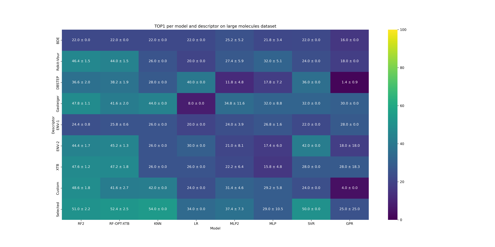
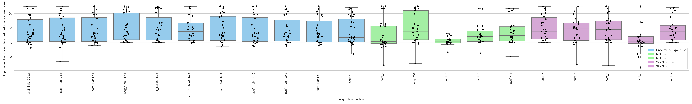
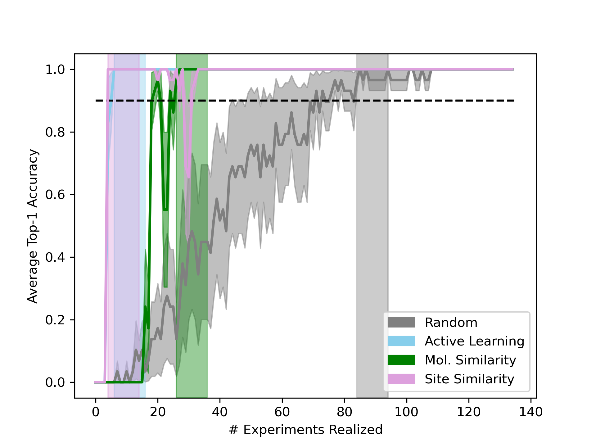

# regio_dataset_design

## Overview
This code supports the results published in [*J. Am. Chem. Soc.* **2025**, 147, 9, 7476–7484 **Designing Target-specific Data Sets for Regioselectivity Predictions on Complex Substrates**](https://pubs.acs.org/doi/10.1021/jacs.4c15902). A previous *Chemrxiv* version is available [here](https://chemrxiv.org/engage/chemrxiv/article-details/670af7ffcec5d6c142f850d3).

## Citation

If you use this code or part of it please cite: *J. Am. Chem. Soc.* **2025**, 147, 9, 7476–7484.

## Organization

The repository is divided in 7 folders:
 - data:                          experimental data and descriptors
 - model_validation:              scripts to run the modeling of the C(sp<sup>3</sup>)–H oxidations and the C(sp<sup>2</sup>)–H borylations
 - active_learning:               scripts to run the acquisition functions and evaluate the learning curves
 - results:                       contains the raw files obtained when running the active_learning or model_validation scripts
 - utils:                         main functions used for preprocessing/descriptor_generation/modeling/active_learning...
 - figures:                       notebooks to reproduce main text and SI figures
 - distribution_shift_analysis:   attempts to characterize distribution shift

Each folder contains a README file with specific details.

## Dependencies

The package requires Conda to be installed.
For best usage please install a conda environement using the ```regio_data.yml``` file and activate it by running the following lines:

```
conda env create -f regio_data.yml
conda activate regio_data
```

**Note:** The installation might take several minutes

## Data preprocessing

This section guides through preprocessing on the dioxirane reactions dataset.
Our raw data file is called "dataset_crude.xlsx" and can be found in data/dioxirane_reaction_data. The files contains experimental dioxirane reactions data performed using various substrates, including reaction conditions and regioselectivity data.

*we provide here the workflow for the data preprocessing. An already preprocessed data file is also available, allowing testing of the package modeling without completing the preprocessing workflow.* 

### Data filtering

First, damaged data or data with no sufficient information is filtered out. For that, run the following:
```
cd data
python Filter_data.py
```

### Descriptors computation
After filtering, generate descriptors for the relevant substrates. To extract canonical SMILES strings from the filtered data and compute descriptors, run the following:

```
python get_can_smi.py
python descriptors/compute_desc.py --desc 'ALL' --csv can_smiles.csv
```
**Note:** Normally descriptors computation can take a long time. We’ve included a precomputed JSON file with descriptors to streamline this process. To test descriptor computation on a smaller scale, it is possible to run the script with ***--csv test_smiles.csv***

### Preprocess for modelling
The final preprocessing step merges the computed descriptors with selectivity data into a single file. run this by the following script:
```
python preprocess_reactions.py --out 'preprocessed_dioxirane_reactions' --in_folder 'dioxirane_reaction_data' --in_file 'dataset_crude_filtered.xlsx'
```

## Modeling

### Performing new tests:

1. Model screening

As a test for the workflow, the following script demonstrates how to run the model we used, which is trained on small molecules with less than 15 carbons and evaluated on large molecules with >15 carbons. The script will train several models on the same data, and produce comparative evaluation for all of them. To run the demonstration execute the following script:
```
cd model_validation/regression/large_mol
python perf_bm.py --run 'test'
```
For the demonstration, the default parameters will only screen 4 models. All models can be tested by adding the argument ``--model 'all'`` but it takes more time. Note that if folder named 'test' is already in *results/model_validation/regression/large_mol/*, the script will stop to avoid overwritting results.

2. Plot figures
   
Once the results have been generated a figure of the models-descriptors overall performances and a figure of the regioselectivity predictions for one specific combination model-descriptor (here after ``--model RF2`` and ``--desc Custom``) on each target can be generated in an homonym folder using the following line:
```
python figures_bm.py --run test --desc Custom --model RF2 --rxn dioxirane 
```
The figures will be available in a folder named *test* in *model_validation/regression/large_mol/*. 

### Reproducing figures from the manuscript

The following script enables the download of the manuscript model and reproduction of the figures for the large molecules model:

```
cd model_validation/regression
python download.py
cd large_mol 
python figures_bm.py --run average --desc Custom --model RF2 --rxn dioxirane
```   

Generates this type of figures for TOP-1, TOP-2, TOP-3, TOP-5 and TOP-AVG:
       



**Note:** Reproducing the results of the leave-one-out evalutaions is also possible. See the Readme file inside the model_validation folder for details.


## Active learning

This section contains scripts for running the active learning procedure using a random forest model and generating visualizations of the results.

### Modelling and results:
   
To test active learning on a single target using one acquisition function (AF), run the following:

```
cd active_learning/regression
python main.py --smi "COC(=O)CC[C@@H](C)[C@H]1CC[C@H]2[C@@H]3CC[C@@H]4C[C@H](OC(C)=O)CC[C@]4(C)[C@H]3CC[C@]12C" --acqf "acqf_2-1"
```

Arguments are available to specify target SMILES, acquistion function, batch size, warm/cold start, feature type, and more. By default, results are saved in *results/active_learning/regression/test*. Each run takes ~15 minutes for the active-learning AF and ~2 minutes for other AFs.
         
To generate results across multiple acquisition functions and targets, use the ```run_acqf.sh``` script.

### Reproducing figures from the manuscript

This workflow reproduces figures from the manuscript, including learning curves and performance comparisons.

In order to download the manusript data, run the following script from ```active_learning/regression```:
```
python download.py
```
   
- To visualize the learning curves for each molecules by acquisition functions featuring TOP-1, TOP-2, TOP-3, TOP-5, and TOP-10, can be obtained using ```learning_curve.py```. Precomputed learning curves can be found in [active_learning/regression/clean_run/learning_curves_10](active_learning/regression/clean_run/learning_curves_10).

```
python learning_curve.py --overwrite True
```

O[C@H]1CC[C@@]2(C)[C@@H](CC(=O)[C@@H]3[C@@H]2CC[C@]2(C)[C@@H]([C@H](C)CCCC(C)C)CC[C@@H]32)C1.png) 
         
- To generate plots comparing each acquisition function to the random baseline, use script ```baseline_comparisons.py```. There is a choice of metric type (AUC or training set size at stable performance) and a choice of figure type (bar plot, box plot, or violin plot) which can be passed in as command line arguments. For the metrics, performance threshold, duration and dataset (to remove) can also be specified as command line arguments.

```
python baseline_comparisons.py --path "regression/clean_run" --out "clean_run"
```


         
- To compare AFs on a same plot for a specific SMILES:

```
python learning_curve_comp.py --smi "CC(=O)O[C@H]1CC[C@@]2(C)[C@@H](CC(=O)[C@@H]3[C@@H]2CC[C@]2(C)[C@@H]([C@H](C)CCCC(C)C)CC[C@@H]32)C1"
```
 
    

Detailed results for each target are available in [active_learning/regression/clean_run/learning_curves_comp](active_learning/regression/clean_run/learning_curves_comp) and can be computed using ```print_all_lc_comp.py```.


