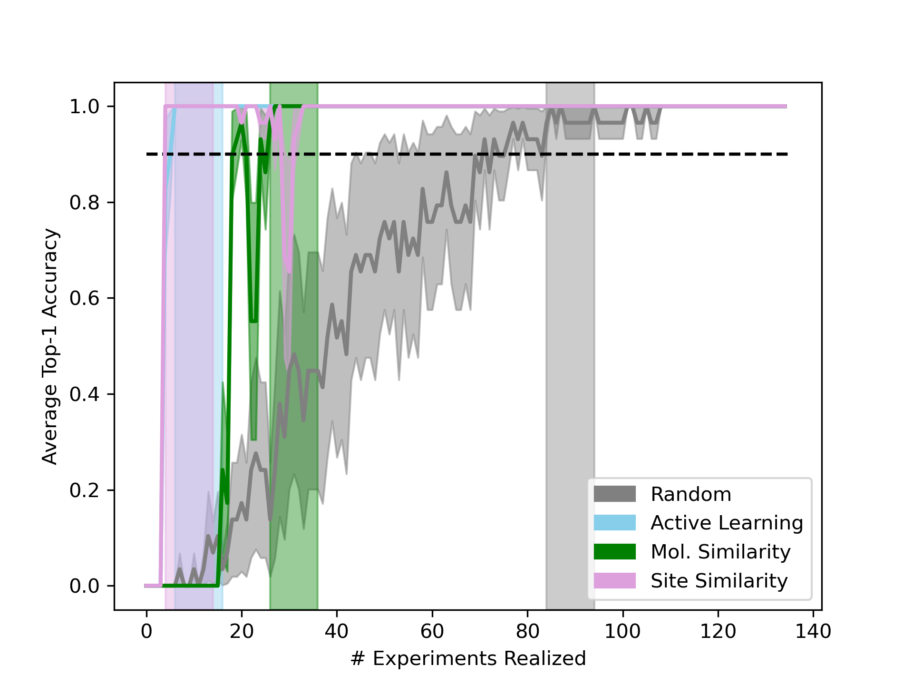

## active_learning

**regression:** contains scripts to generate results of acquisition functions on targets as well as to generate visualizations using a random forest model

1. Generate results:
   
- To generate results of one acquisition function (AF) on one target using the same model to select molecules and to evaluate performance, use ```main.py```. SMILES, acquistion function, batch size, warm/cold start, feature type, among other parameters can be specified as command line arguments. by default the results are save in *results/active_learning/regression/test*. For the active-learning AF, one run takes ~15min, for the others AF one run is ~2min. 

```
python main.py
pythom main.py --smi "COC(=O)CC[C@@H](C)[C@H]1CC[C@H]2[C@@H]3CC[C@@H]4C[C@H](OC(C)=O)CC[C@]4(C)[C@H]3CC[C@]12C" --acqf "acqf_2-1"
```
         
- To generate results for multiple acquisition functions and multiple targets, the ```run_acqf.sh``` script can be used.

2. Visualize results:
   
- To visualize the learnig curves for each molecules by acquisition functions featuring TOP-1, TOP-2, TOP-3, TOP-5, and TOP-10, can be obtained using ```learning_curve.py```. Precomputed learning curves can be found in [active_learning/regression/clean_run/learning_curves_10](active_learning/regression/clean_run/learning_curves_10).

```
python learning_curve.py --overwrite True
```

O[C@H]1CC[C@@]2(C)[C@@H](CC(=O)[C@@H]3[C@@H]2CC[C@]2(C)[C@@H]([C@H](C)CCCC(C)C)CC[C@@H]32)C1.png) 

- To change the model used for performance evaluation of the acquisition functions, use ```eval_perf_new_model.py```. The path to a folder containing the initial acquisition function results must be specified, and a new folder containing the results with performance recomputed with a new model will be created. Performance can be recomputed using a ranking or random forest model. The input and output folders, the descriptor type, and the model choice can be passed in as command line arguments.
         
- To generate plots comparing each acquisition function to the random baseline, use script ```baseline_comparisons.py```. There is a choice of metric type (AUC or training set size at stable performance) and a choice of figure type (bar plot, box plot, or violin plot) which can be passed in as command line arguments. For the metrics, performance threshold, duration and dataset (to remove) can also be specified as command line arguments.

```
python baseline_comparisons.py --path "regression/clean_run" --out "clean_run"
```


         
- To compare AFs on a same plot for a specific SMILES:

```
python learning_curve_comp.py --acqf_list "["acqf_1", "acqf_2", "acqf_6"]" --smi "CC(=O)O[C@H]1CC[C@@]2(C)[C@@H](CC(=O)[C@@H]3[C@@H]2CC[C@]2(C)[C@@H]([C@H](C)CCCC(C)C)CC[C@@H]32)C1"
```
 
    

Note that the results detailed for each target can be found in [active_learning/regression/clean_run/learning_curves_comp](active_learning/regression/clean_run/learning_curves_comp) and can be computed using ```print_all_lc_comp.py```.


**experimental:** 

Same workflow for additional targets.
