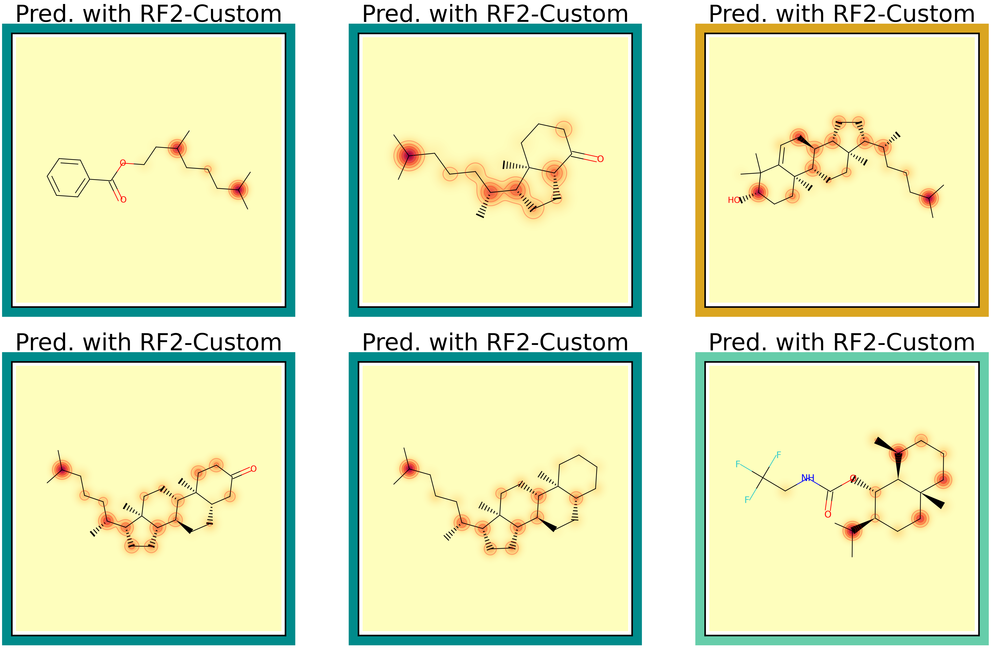
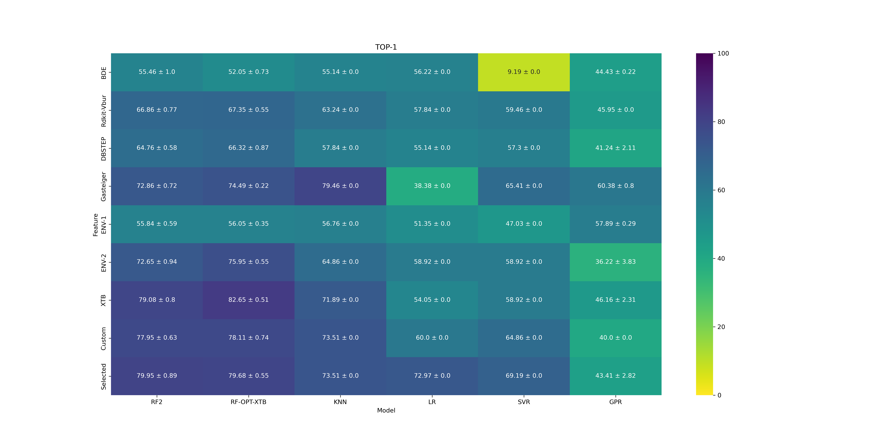

# model_validation

## regression

contains two folders:
- **large_mol** for the large_mol validation task.
- **loo** for the leave-one-out task.

These validations and the plot of the figures can obtained using details below.

## large_mol

### Performing new tests:

1. Generate results

The default parameters will only screen 4 models, all models can be tested with the argument ``--model 'all'`` but it takes more time. 
```
python perf_bm.py --run 'test'
```
Note that if folder named 'test' is already in *results/model_validation/regression/large_mol/*, the script will stop to avoid overwritting results.

2. Plot figures

Once the results have been generated a figure of the models-descriptors overall performances and a figure of the regioselectivity predictions for one specific combination model-descriptor (here after ``--model RF2`` and ``--desc Custom``) on each target can be generated in an homonym folder using the following line:
```
python figures_bm.py --run test --desc Custom --model RF2 --rxn dioxirane 
```
The figures will be available in a folder named *test* in *model_validation/regression/large_mol/*. 

### Reproducing figures from the manuscript

```
python figures_bm.py --run average --desc Custom --model RF2 --rxn dioxirane
```   

Generates this type of figures for TOP-1, TOP-2, TOP-3, TOP-5 and TOP-AVG:
       


And the regioselectivity plot detailed per molecules:




## loo

### performing new tests:

1. Generate results

The default parameters will only screen 4 models with 3 descriptors, all models can be tested with the arguments ``--model 'all'`` and ``--desc 'all'`` but it takes more time (the default run can take up to 1h per model-descriptor combination). 
```
python perf_loo.py --run 'test'
```

2. Plot figures

Once the results have been generated a figure of the models-descriptors overall performances can be generated in an homonym folder using the following line:
```
python figures_loo.py --run test
```
The figures will be available in a folder named *test* in *model_validation/regression/loo/*. 


### reproducing figures from the manuscript

```   
python figure_loo.py --run average --desc Selected --model RF2
```   

Generates this type of figures for TOP-1, TOP-2, TOP-3, TOP-5 and TOP-AVG:
       

